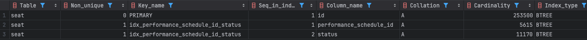

# 콘서트 예약 서비스

---

## 프로젝트 산출물

#### [Flow chart](docs/FLOW.md)

#### [Sequence diagram](docs/SEQUENCE.md)

#### [ERD](docs/ERD.md)

#### [API 명세](docs/API.md)

#### [Git Branch 전략](docs/git-branch.md)

---

## 성능 개선

### 인덱스 설정
- 25만 건 더미데이터 활용

#### 예약 가능한 좌석 리스트 조회
```sql
select *
from seat
where performance_schedule_id = {id} and status = 'OPEN';
```

#### 카디널리티 수치 확인
```sql
SELECT
    CONCAT(ROUND(COUNT(DISTINCT id) / COUNT(*) * 100, 2), '%') AS id_cardinality,
    CONCAT(ROUND(COUNT(DISTINCT performance_schedule_id) / COUNT(*) * 100, 2), '%') AS performance_schedule_id_cardinality,
    CONCAT(ROUND(COUNT(DISTINCT price) / COUNT(*) * 100, 2), '%') AS price_cardinality,
    CONCAT(ROUND(COUNT(DISTINCT seat_no) / COUNT(*) * 100, 2), '%') AS seat_no_cardinality,
    CONCAT(ROUND(COUNT(DISTINCT status) / COUNT(*) * 100, 2), '%') AS status_cardinality
FROM seat;
```


#### 인덱스 생성
```sql
create index idx_performance_schedule_id_status on seat(performance_schedule_id, status);

show index from seat;
```


#### 실행 계획
```sql
explain
select *
from seat
where performance_schedule_id = {id} and status = 'OPEN';
```

[ 인덱스 생성 전 ]


[ 인덱스 생성 후 ]


#### Profiling
```sql
show profile cpu for query {query_id};
```


- 성능 개선 : `0.084201` -> `0.002176`

---

## 동시성 제어

### 포인트 충전/사용

- 포인트 충전/사용의 경우 유저 별로 일어나기 때문에 충돌은 적을 것으로 예상된다.
- 하지만 동시 요청이 일어날 경우 실패 보다는 순차 처리가 되는 것이 좋다.

-> 비관적 락을 이용하여 포인트를 변경한다.

### 좌석 예약

- 좌석은 예약 가능/불가능 두가지 상태가 있다.
- 동시에 예약을 시도해서 한 명이 성공 하면 나머지 작업은 실패한다.
- 실패 후 재시도 또는 후처리가 필요하지 않다.
- 좌석의 예약 충돌이 많이 일어날 것으로 예상된다.

-> 비관적 락을 이용하여 좌석 상태를 변경한다.

### 예약 좌석 결제

- 좌석에 대한 예약은 5분 동안 한 사람이 점유하고 있다.
- 동시 결제 요청이 일어날 일이 매우 적어 충돌이 일어날 확률이 적다.
- 만약 동시 결제 요청이 일어나면 한 번만 성공하고 나머지는 실패한다.
- 실패 후 재시도 또는 후처리가 필요하지 않다.
- 백 그라운드에서 만료된 예약들을 만료 상태로 변경 처리하는 배치 작업이 진행 중이다.

-> 낙관적 락을 이용하여 예약 상태를 변경한다.
