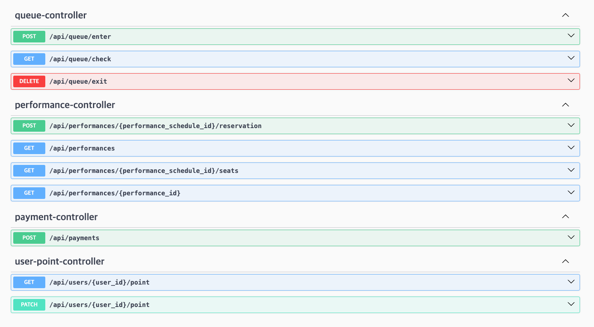

## 📝 API

### Swagger


### 공통 응답

| Name    | Type     | Description |
|:--------|:---------|:------------|
| code    | `int`    | 응답 코드       |
| message | `String` | 응답 메시지      |
| body    | `object` | 응답 결과       |

```json
{
  "code": 0,
  "message": "string",
  "body": {}
}
```

### API 명세

| METHOD | URI                                              | 기능                |
|--------|--------------------------------------------------|-------------------|
| GET    | `/api/users/{user_id}/point`                     | 포인트 잔액 조회         |
| PATCH  | `/api/users/{user_id}/point`                     | 포인트 충전            |
| POST   | `/api/queue/enter`                               | 대기열 진입(대기열 토큰 생성) |
| GET    | `/api/queue/check`                               | 대기열 확인            |
| DELETE | `/api/queue/exit`                                | 대기열 삭제            |
| GET    | `/api/performances`                              | 공연 리스트 조회         |
| GET    | `/api/performances/{performance_info_id}`        | 공연 날짜 리스트 조회      |
| GET    | `/api/performances/{performance_id}/seats`       | 좌석 정보 조회          |
| POST   | `/api/performances/{performance_id}/reservation` | 좌석 예약             |
| POST   | `/api/payments`                                  | 결제                |

### 포인트 잔액조회

#### URL

```http request
GET /api/users/{user_id}/point HTTP/1.1
Host: 127.0.0.1:8080
```

#### Request Param

| Name    | Type   | Description | Required |
|:--------|:-------|:------------|:---------|
| user_id | `Long` | 유저 식별 ID    | O        |

#### Response Body(성공) - 200 OK

| Name  | Type      | Description |
|:------|:----------|:------------|
| id    | `Long`    | 유저 식별 ID    |
| name  | `String`  | 유저 이름       |
| point | `Integer` | 유저 포인트 잔액   |

```json
{
  "code": 0,
  "message": "success",
  "body": {
    "user_id": 1,
    "user_name": "유저1",
    "point": 10000
  }
}
```

### 포인트 충전

#### URL

```http request
PATCH /api/users/{user_id}/point HTTP/1.1
Host: 127.0.0.1:8080
```

#### Request Param

| Name    | Type   | Description | Required |
|:--------|:-------|:------------|:---------|
| user_id | `Long` | 유저 식별 ID    | O        |

#### Request Body

| Name   | Type      | Description | Required |
|:-------|:----------|:------------|:---------|
| amount | `Integer` | 충전 수량       | O        |

```json
{
  "amount": 10000
}
```

#### Response Body(성공) - 200 OK

```json
{
  "code": 0,
  "message": "success",
  "body": null
}
```

### 대기열 진입(대기열 토큰 생성)

#### URL

```http request
POST /api/queue/enter HTTP/1.1
Host: 127.0.0.1:8080
```

#### Response Body(성공) - 200 OK

| Name   | Type      | Description          |
|:-------|:----------|:---------------------|
| token  | `String`  | 대기열 토큰               |
| rank   | `Integer` | 대기 순번                |
| status | `String`  | WAITING / PROCEEDING |

```json
{
  "code": 0,
  "message": "success",
  "body": {
    "token": "abccf329-0e0e-417f-8f47-d97079761e3c",
    "rank": 30,
    "status": "WAITING"
  }
}
```

### 대기열 확인

#### URL

```http request
GET /api/queue/check HTTP/1.1
Host: 127.0.0.1:8080
```

#### Request Header

| Name     | Type     | Description | Required |
|:---------|:---------|:------------|:---------|
| wq-token | `String` | 대기열 토큰      | O        |

#### Response Body(성공) - 200 OK

| Name   | Type      | Description          |
|:-------|:----------|:---------------------|
| token  | `String`  | 대기열 토큰               |
| rank   | `Integer` | 대기 순번                |
| status | `String`  | WAITING / PROCEEDING |

```json
{
  "code": 0,
  "message": "success",
  "body": {
    "token": "abccf329-0e0e-417f-8f47-d97079761e3c",
    "rank": 30,
    "status": "WAITING"
  }
}
```

### 대기열 삭제

#### URL

```http request
DELETE /api/queue/exit HTTP/1.1
Host: 127.0.0.1:8080
```

#### Request Header

| Name     | Type     | Description | Required |
|:---------|:---------|:------------|:---------|
| wq-token | `String` | 대기열 토큰      | O        |

#### Response Body(성공) - 200 OK

```json
{
  "code": 0,
  "message": "success",
  "body": null
}
```

### 공연 리스트 조회

#### URL

```http request
GET /api/performances HTTP/1.1
Host: 127.0.0.1:8080
```

#### Request Header

| Name     | Type     | Description | Required |
|:---------|:---------|:------------|:---------|
| wq-token | `String` | 대기열 토큰      | O        |

#### Response Body(성공) - 200 OK

| Name                | Type      | Description |
|:--------------------|:----------|:------------|
| performance_info_id | `Lnog`    | 공연 정보 식별 ID |
| title               | `array`   | 공연 제목       |
| content             | `Integer` | 공연 내용       |

```json
{
  "code": 0,
  "message": "success",
  "body": {
    "performances": [
      {
        "performance_info_id": 1,
        "title": "콘서트 제목!!",
        "content": "콘서트 내용!!"
      },
      {
        "performance_info_id": 2,
        "title": "콘서트 제목2!!",
        "content": "콘서트 내용2!!"
      }
    ],
    "page": {
      "page_no": 1,
      "page_size": 5,
      "total_elements": 10
    }
  }
}
```

### 공연 날짜 리스트 조회

#### URL

```http request
GET /api/performances/{performance_info_id} HTTP/1.1
Host: 127.0.0.1:8080
```

#### Request Header

| Name     | Type     | Description | Required |
|:---------|:---------|:------------|:---------|
| wq-token | `String` | 대기열 토큰      | O        |

#### Request Param

| Name                | Type   | Description | Required |
|:--------------------|:-------|:------------|:---------|
| performance_info_id | `Long` | 공연 정보 식별 ID | O        |

#### Response Body(성공) - 200 OK

| Name    | Type      | Description |
|:--------|:----------|:------------|
| title   | `array`   | 공연 제목       |
| content | `Integer` | 공연 내용       |
| date    | `array`   | 공연 날짜 리스트   |

```json
{
  "code": 0,
  "message": "success",
  "body": {
    "title": "콘서트 제목!!",
    "content": "콘서트 내용!!",
    "date": [
      {
        "performance_id": 1,
        "reservation_at": "2024-04-15 17:00",
        "start_at": "2024-05-05 17:00",
        "end_at": "2024-05-05 20:00"
      },
      {
        "performance_id": 2,
        "reservation_at": "2024-05-15 17:00",
        "start_at": "2024-06-05 17:00",
        "end_at": "2024-06-05 20:00"
      }
    ]
  }
}
```

### 좌석 정보 조회

#### URL

```http request
GET /api/performances/{performance_id}/seats HTTP/1.1
Host: 127.0.0.1:8080
```

#### Request Header

| Name     | Type     | Description | Required |
|:---------|:---------|:------------|:---------|
| wq-token | `String` | 대기열 토큰      | O        |

#### Request Param

| Name           | Type   | Description | Required |
|:---------------|:-------|:------------|:---------|
| performance_id | `Long` | 공연 식별 ID    | O        |

#### Response Body(성공) - 200 OK

| Name            | Type      | Description |
|:----------------|:----------|:------------|
| available_seats | `array`   | 좌석 리스트      |
| total_seats     | `Integer` | 총 좌석 개수     |
| remaining_seats | `Integer` | 남은 좌석 개수    |

```json
{
  "code": 0,
  "message": "success",
  "body": {
    "available_seats": [
      {
        "seat_id": 10,
        "seat_no": 1,
        "price": 10000
      },
      {
        "seat_id": 15,
        "seat_no": 4,
        "price": 20000
      }
    ],
    "total_seats": 50,
    "remaining_seats": 2
  }
}
```

### 좌석 예약

#### URL

```http request
POST /api/performances/{performance_id}/reservation HTTP/1.1
Host: 127.0.0.1:8080
```

#### Request Header

| Name     | Type     | Description | Required |
|:---------|:---------|:------------|:---------|
| wq-token | `String` | 대기열 토큰      | O        |

#### Request Param

| Name           | Type   | Description | Required |
|:---------------|:-------|:------------|:---------|
| performance_id | `Long` | 공연 식별 ID    | O        |

#### Request Body

| Name    | Type      | Description | Required |
|:--------|:----------|:------------|:---------|
| user_id | `Long`    | 유저 식별 ID    | O        |
| seat_no | `Integer` | 좌석 번호       | O        |

```json
{
  "user_id": 1,
  "seat_no": 5
}
```

#### Response Body(성공) - 200 OK

| Name           | Type   | Description |
|:---------------|:-------|:------------|
| reservation_id | `Long` | 예약 식별 ID    |

```json
{
  "code": 0,
  "message": "success",
  "body": {
    "reservation_id": 1
  }
}
```

### 결제

#### URL

```http request
POST /api/payments HTTP/1.1
Host: 127.0.0.1:8080
```

#### Request Body

| Name           | Type   | Description | Required |
|:---------------|:-------|:------------|:---------|
| reservation_id | `Long` | 예약 식별 ID    | O        |

```json
{
  "reservation_id": 15
}
```

#### Response Body(성공) - 200 OK

```json
{
  "code": 0,
  "message": "success",
  "body": null
}
```