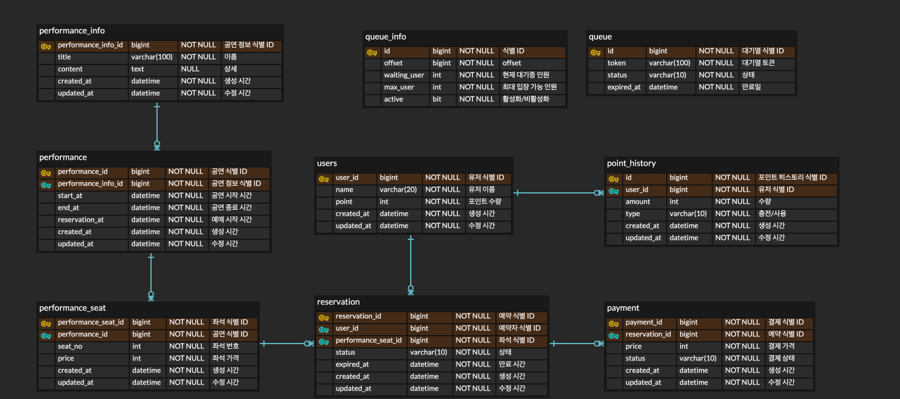

### 테이블 정보

| Table              | Description |
|:-------------------|:------------|
| `users`            | 유저          |
| `point_history`    | 포인트 히스토리    |
| `performance_info` | 공연 정보       |
| `performance`      | 공연          |
| `performance_seat` | 공연 좌석       |
| `reservation`      | 예약          |
| `payment`          | 결제          |
| `queue`            | 대기열         |
| `queue_info`       | 대기열 정보      |

### ERD

