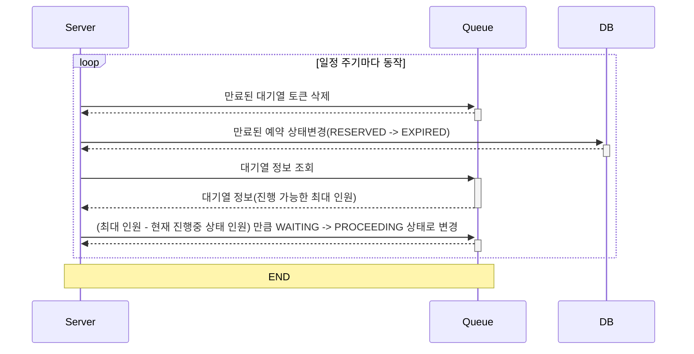
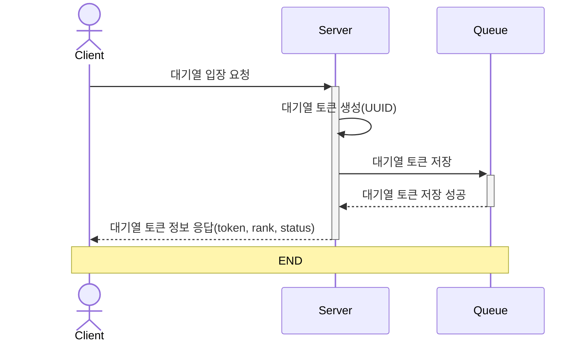
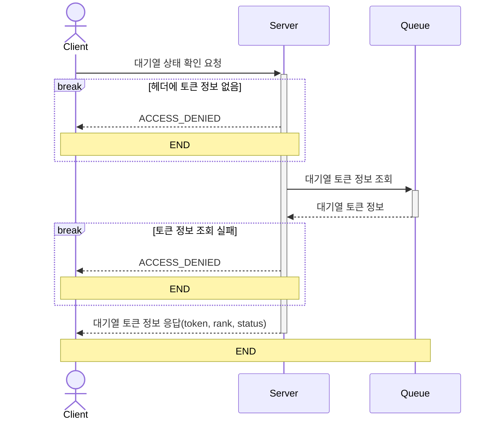
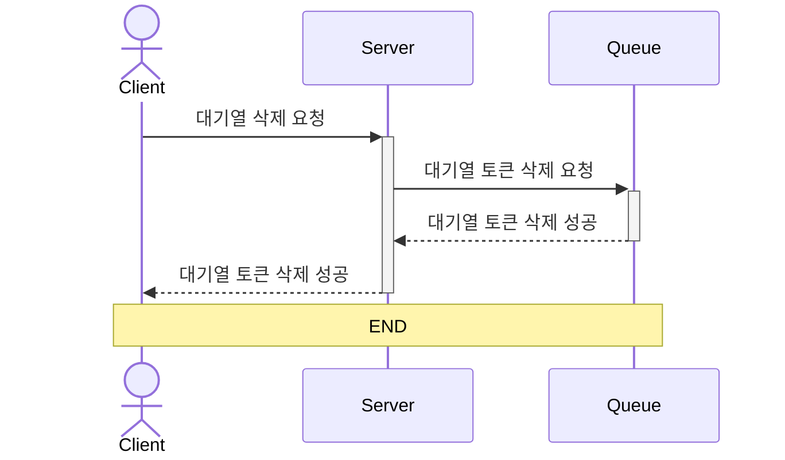
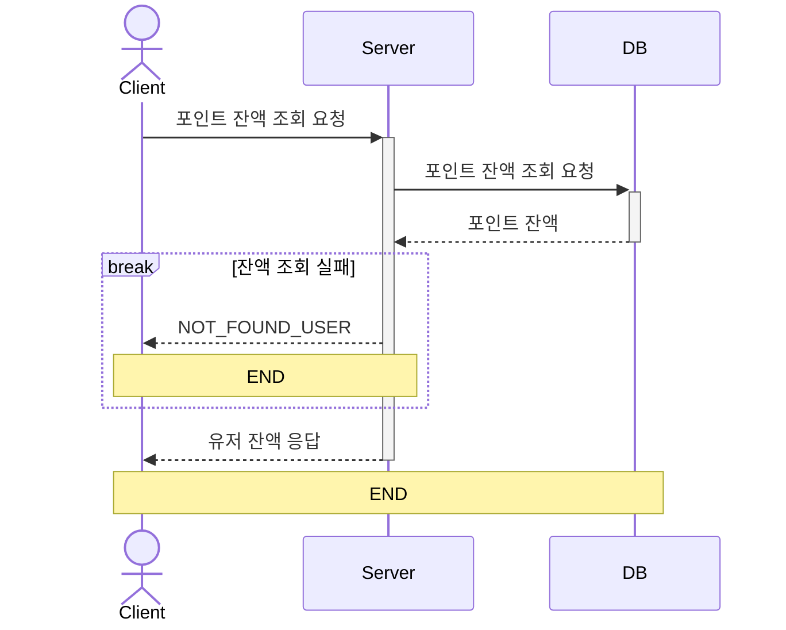
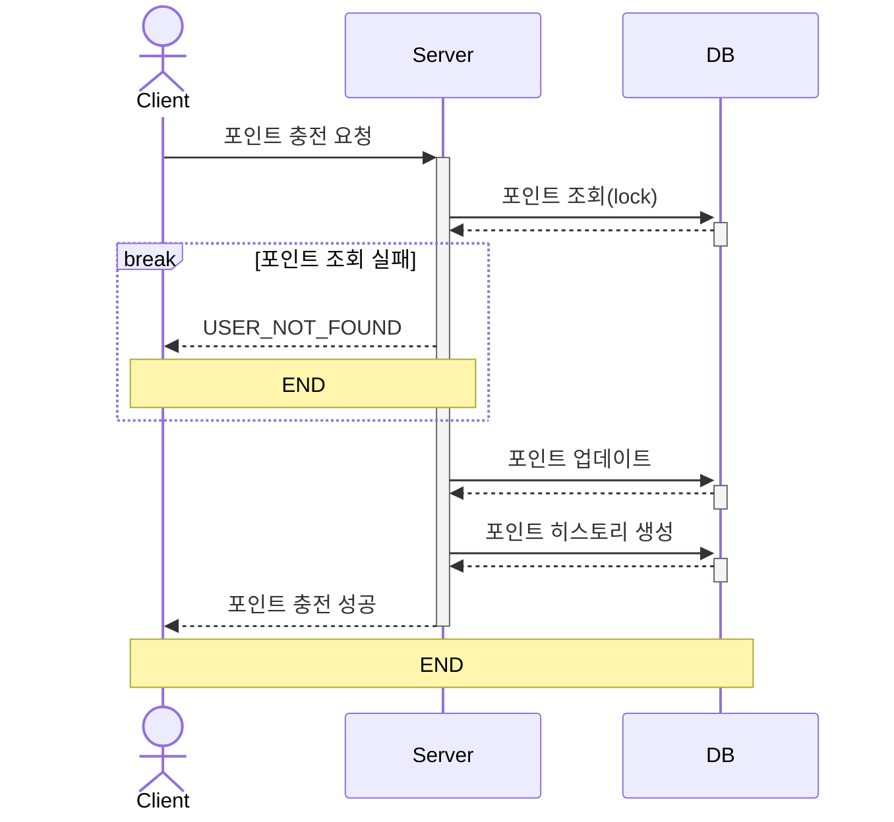
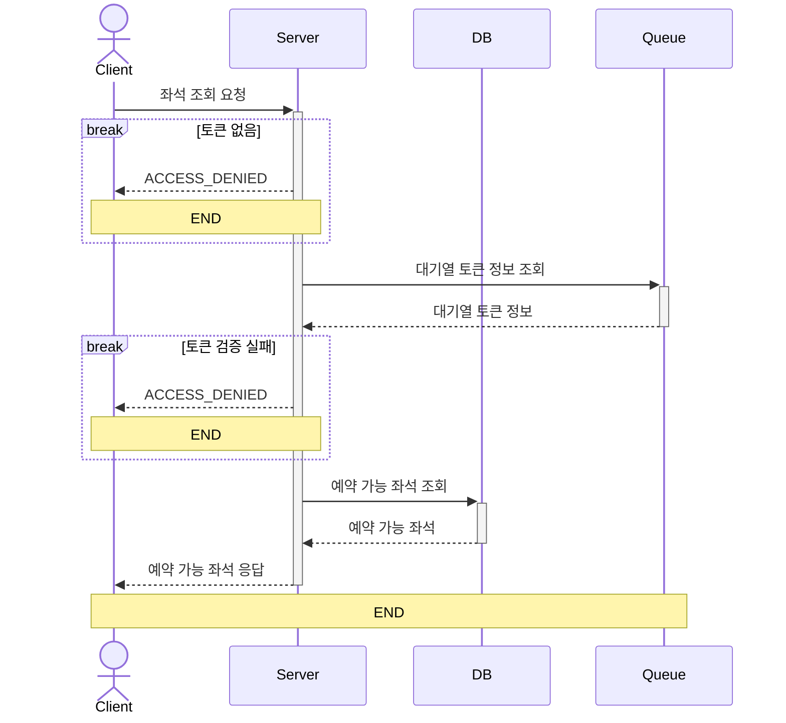
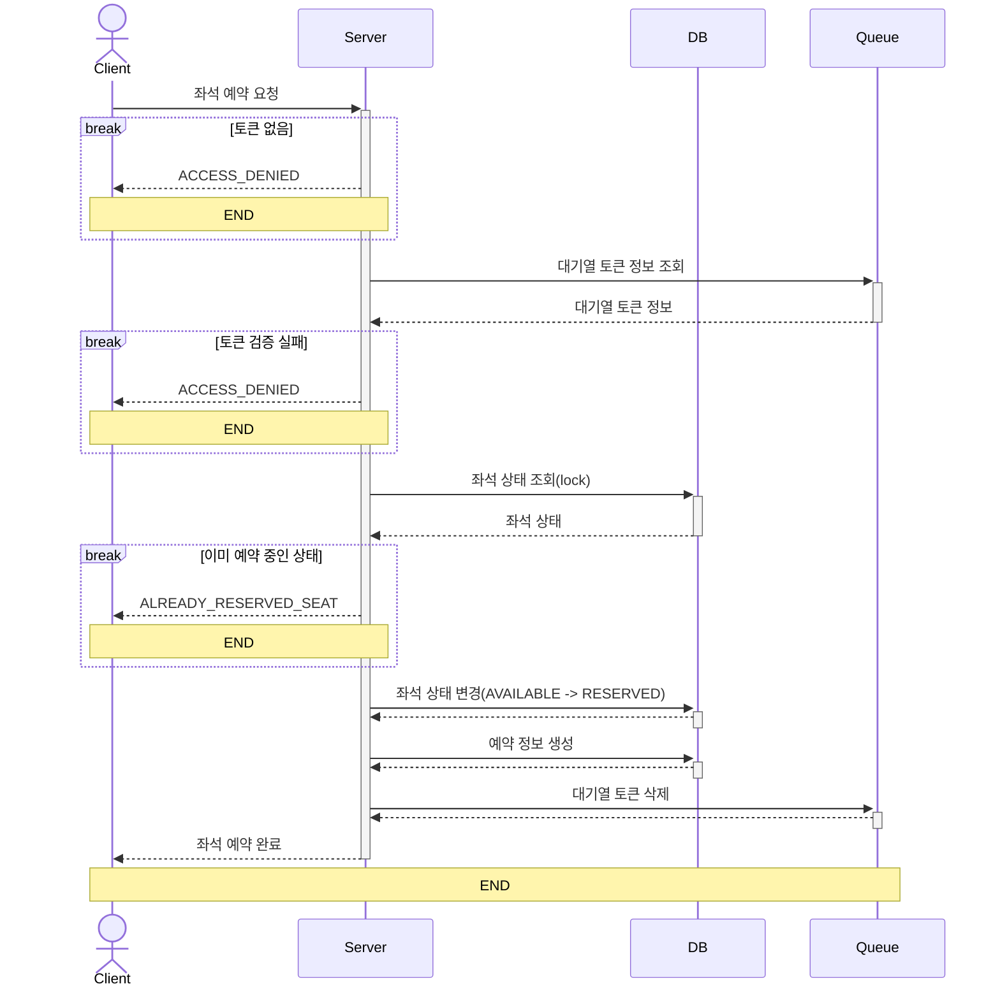
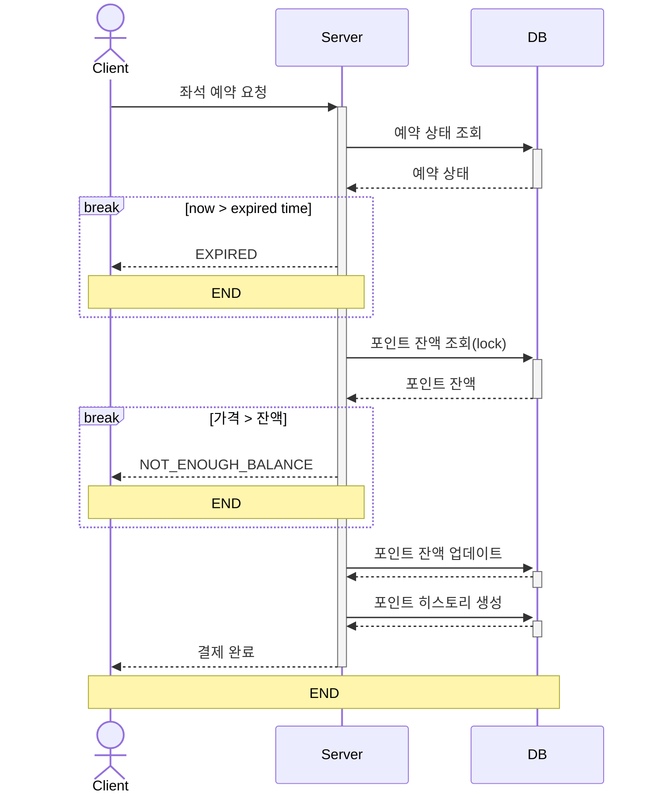

### 대기열 상태 변경 스케줄러

```mermaid
sequenceDiagram
    participant Server
    participant Queue
    participant DB
    
    loop 일정 주기마다 동작
        Server ->>+ Queue: 만료된 대기열 토큰 삭제
        Queue -->>- Server: 
        
        Server ->>+ DB: 만료된 예약 상태변경(RESERVED -> EXPIRED)
        DB -->>- Server: 
        
        Server ->>+ Queue: 대기열 정보 조회
        Queue -->>- Server: 대기열 정보(진행 가능한 최대 인원)

        Server ->>+ Queue: (최대 인원 - 현재 진행중 상태 인원) 만큼 WAITING -> PROCEEDING 상태로 변경 
        Queue -->>- Server: 
    end
    
    note over Server, Queue: END
```

### 대기열 생성 API

```mermaid
sequenceDiagram
    actor Client
    participant Server
    participant Queue
    Client ->>+ Server: 대기열 입장 요청
    Server ->> Server: 대기열 토큰 생성(UUID)
    Server ->>+ Queue: 대기열 토큰 저장
    Queue -->>- Server: 대기열 토큰 저장 성공
    Server -->>- Client: 대기열 토큰 정보 응답(token, rank, status)
    note over Client, Queue: END

```

### 대기열 상태 확인 API

```mermaid
sequenceDiagram
    actor Client
    participant Server
    participant Queue
    Client ->>+ Server: 대기열 상태 확인 요청

    break 헤더에 토큰 정보 없음
        Server -->> Client: ACCESS_DENIED
        note over Server, Client: END
    end

    Server ->>+ Queue: 대기열 토큰 정보 조회
    Queue -->>- Server: 대기열 토큰 정보

    break 토큰 정보 조회 실패
        Server -->> Client: ACCESS_DENIED
        note over Server, Client: END
    end

    Server -->>- Client: 대기열 토큰 정보 응답(token, rank, status)
    note over Client, Queue: END
```

### 대기열 삭제 API

```mermaid
sequenceDiagram
    actor Client
    participant Server
    participant Queue
    Client ->>+ Server: 대기열 삭제 요청

    Server ->>+ Queue: 대기열 토큰 삭제 요청
    Queue -->>- Server: 대기열 토큰 삭제 성공

    Server -->>- Client: 대기열 토큰 삭제 성공
    note over Client, Queue: END
```

### 포인트 잔액 조회 API

```mermaid
sequenceDiagram
    actor Client
    participant Server
    participant DB
    Client ->>+ Server: 포인트 잔액 조회 요청
    Server ->>+ DB: 포인트 잔액 조회 요청
    DB -->>- Server: 포인트 잔액

    break 잔액 조회 실패
        Server -->> Client: NOT_FOUND_USER
        note over Client, Server: END
    end
    
    Server -->>- Client: 유저 잔액 응답
    note over Client, DB: END
```

### 포인트 충전 API

```mermaid
sequenceDiagram
    actor Client
    participant Server
    participant DB
    
    Client ->>+ Server: 포인트 충전 요청
    Server ->>+ DB: 포인트 조회(lock)
    DB -->>- Server: 

    break 포인트 조회 실패
        Server -->> Client: USER_NOT_FOUND
        note over Client, Server: END
    end

    Server ->>+ DB: 포인트 업데이트
    DB -->>- Server: 

    Server ->>+ DB: 포인트 히스토리 생성
    DB -->>- Server:  
 
    Server -->>- Client: 포인트 충전 성공
    note over Client, DB: END
```

### 좌석 조회 API

```mermaid
sequenceDiagram
    actor Client
    participant Server
    participant DB
    participant Queue
    Client ->>+ Server: 좌석 조회 요청

    break 토큰 없음
        Server -->> Client: ACCESS_DENIED
        note over Client, Server: END
    end
    
    Server ->>+ Queue: 대기열 토큰 정보 조회
    Queue -->>- Server: 대기열 토큰 정보

    break 토큰 검증 실패
        Server -->> Client: ACCESS_DENIED
        note over Client, Server: END
    end

    Server ->>+ DB: 예약 가능 좌석 조회
    DB -->>- Server: 예약 가능 좌석
    
    Server -->>- Client: 예약 가능 좌석 응답
    note over Client, Queue: END
```

### 좌석 예약 API

```mermaid
sequenceDiagram
    actor Client
    participant Server
    participant DB
    participant Queue
    Client ->>+ Server: 좌석 예약 요청

    break 토큰 없음
        Server -->> Client: ACCESS_DENIED
        note over Client, Server: END
    end
    
    Server ->>+ Queue: 대기열 토큰 정보 조회
    Queue -->>- Server: 대기열 토큰 정보

    break 토큰 검증 실패
        Server -->> Client: ACCESS_DENIED
        note over Client, Server: END
    end

    Server ->>+ DB: 좌석 상태 조회(lock)
    DB -->>- Server: 좌석 상태

    break 이미 예약 중인 상태
        Server -->> Client: ALREADY_RESERVED_SEAT
        note over Client, Server: END
    end

    Server ->>+ DB: 좌석 상태 변경(AVAILABLE -> RESERVED)
    DB -->>- Server: 
    
    Server ->>+ DB: 예약 정보 생성
    DB -->>- Server: 

    Server ->>+ Queue: 대기열 토큰 삭제
    Queue -->>- Server: 

    Server -->>- Client: 좌석 예약 완료
    note over Client, Queue: END
```

### 결제 API

```mermaid
sequenceDiagram
    actor Client
    participant Server
    participant DB
    Client ->>+ Server: 좌석 예약 요청
    Server ->>+ DB: 예약 상태 조회
    DB -->>- Server: 예약 상태

    break now > expired time
        Server -->> Client: EXPIRED 
        note over Client, Server: END
    end
    
    Server ->>+ DB: 포인트 잔액 조회(lock)
    DB -->>- Server: 포인트 잔액

    break 가격 > 잔액
        Server -->> Client: NOT_ENOUGH_BALANCE
        note over Client, Server: END
    end

    Server ->>+ DB: 포인트 잔액 업데이트
    DB -->>- Server:   

    Server ->>+ DB: 포인트 히스토리 생성
    DB -->>- Server: 

    Server -->>- Client: 결제 완료
    note over Client, DB: END
```